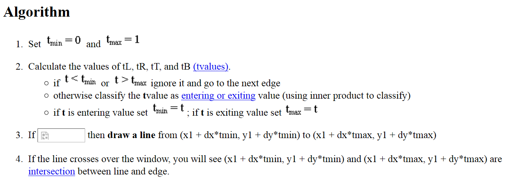
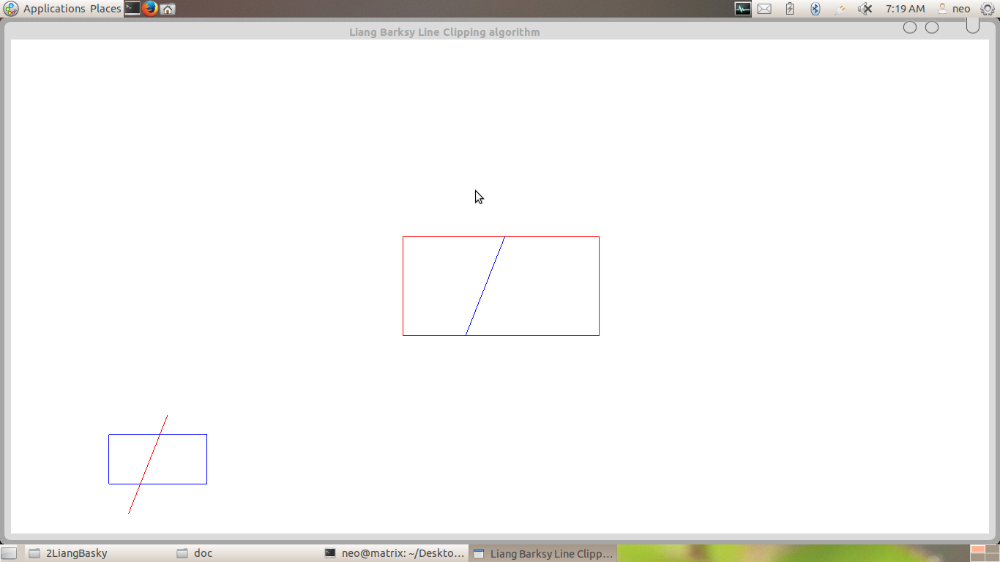

## Aim: 
### Program to implement Liang-Barsky line clipping algorithm.

##Theory
> In computer graphics, 'line clipping' is the process of removing lines or portions of lines outside of an area of interest. Typically, any line or part thereof which is outside of the viewing area is removed.
>The Liang–Barsky algorithm uses the parametric equation of a line and inequalities describing the range of the clipping window to determine the intersections between the line and the clipping window. With these intersections it knows which portion of the line should be drawn.

## Code: liangBasky.c
	#include<stdio.h>
	#include<GL/glut.h>
	double xmin=50,xmax=100,ymax=100,ymin=50;	//window boundary
	double xvmin=200,yvmin=200,xvmax=300,yvmax=300;		//viewport boundary
	#define true 1
	#define false 0
	int cliptest(double p,double q,double *t1,double *t2)
	{
		double t=q/p;
		if(p<0.0)
		{
			if(t>*t1)
				*t1=t;
			if(t>*t2)
				return false;	//line portion is outside
		}
		else if(p>0.0)
		{
			if(t<*t2)
				*t2=t;
			if(t<*t1)
				return false;
		}
		else if(p==0.0)
				if(q<0.0)
					return false;	//line portion is outside
		return true;
	}

	void liang(double x0,double y0,double x1,double y1)
	{
		double dx=x1-x0,dy=y1-y0,tc=0.0,t1=1.0;
		if(cliptest(-dx,x0-xmin,&tc,&t1))	//inside test wrt left edge
			if(cliptest(dx,xmax-x0,&tc,&t1))	//inside test wrt Right edge
				if(cliptest(-dy,y0-ymin,&tc,&t1))	//inside test wrt Bottom edge
					if(cliptest(dy,ymax-y0,&tc,&t1))	//inside test wrt Top edge
					{
						if(t1<1.0)
						{
							x1=x0+t1*dx;
							y1=y0+t1*dy;
						}
						if(tc>0.0)
						{
							x0=x0+tc*dx;
							y0=y0+tc*dy;
						}
				//sx and sy is used to scale the line. it zooms the the clipping window 
						double sx=(xvmax-xvmin)/(xmax-xmin);
						double sy=(yvmax-yvmin)/(ymax-ymin);
						double vx0=xvmin+(x0-xmin)*sx;
						double vy0=yvmin+(y0-ymin)*sy;
  						double vx1=xvmin+(x1-xmin)*sx;
  						double vy1=yvmin+(y1-ymin)*sy;
						//draw red coloured viewport
  						glColor3f(1.0,0.0,0.0);
						glBegin(GL_LINE_LOOP);		//draw a box to show clipped line.
							glVertex2f(xvmin,yvmin);
							glVertex2f(xvmax,yvmin);
							glVertex2f(xvmax,yvmax);
							glVertex2f(xvmin,yvmax);
  						glEnd();
  						glColor3f(0.0,0.0,1.0);
  						glBegin(GL_LINES);			//draw line after clipping
							glVertex2d(vx0,vy0);
							glVertex2d(vx1,vy1);
  						glEnd();
					}
	}
	
	void display()
	{
		double x0=60,y0=20,x1=80,y1=120;		//line coordinates
		glClear(GL_COLOR_BUFFER_BIT);
		glColor3f(1.0,0.0,0.0);
		glBegin(GL_LINES);			//draw a line that needs to be clipped 
			glVertex2d(x0,y0);
			glVertex2d(x1,y1);
		glEnd();
		glColor3f(0.0,0.0,1.0);
		glBegin(GL_LINE_LOOP);		//draw a box
			glVertex2f(xmin,ymin);
  			glVertex2f(xmax,ymin);
  			glVertex2f(xmax,ymax);
  			glVertex2f(xmin,ymax);
		glEnd();
		liang(x0,y0,x1,y1);			//function liang() is called by passing line endpoints
		glFlush();
	}
	//initialses point sizes and colors
	void myinit()
	{
		glClearColor(1.0,1.0,1.0,1.0);
		glColor3f(1.0,0.0,0.0);
		glPointSize(1.0);
		glMatrixMode(GL_PROJECTION);
		glLoadIdentity();
		gluOrtho2D(0.0,499.0,0.0,499.0);
	}
	
	int main(int argc,char **argv)
	{
		glutInit(&argc, argv);
		glutInitDisplayMode(GLUT_SINGLE|GLUT_RGB);
		glutInitWindowSize(500,500);
		glutInitWindowPosition(0,0);
		glutCreateWindow("Liang Barksy Line Clipping algorithm");
		glutDisplayFunc(display);
		myinit();
		glutMainLoop();
		return 0;
	}

## Output:
*Commands for execution:-*

* Open a terminal and Change directory to the file location in both the terminals.
* compile as gcc -lGLU -lGL -lglut liangBasky.c -o liang
* If no errors, run as ./liang

*Screenshots:-*

   

