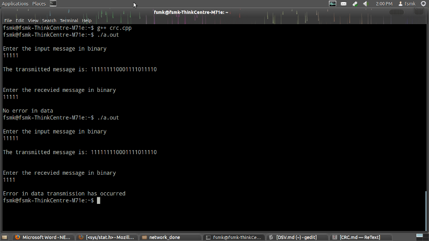

## Aim:
###Write a program for Error Detection using CRC-CCITT(16 bits)

## Description:

> The cyclic redundancy check, or CRC, is a technique for detecting     
errors in digital data, but not for making corrections when errors are detected. It is used primarily in data transmission. 

> In the CRC method, a certain number of check bits, often called a checksum, are appended to the message being transmitted. The receiver can determine whether or not the check bits agree with the data, to ascertain with a certain degree of probability whether or not an error occurred in transmission.

> If an error occurred, the receiver sends a “negative acknowledgement” (NAK) back to the sender, requesting that the message be retransmitted.
The technique is also sometimes applied to data storage devices, such as a disk drive. In this situation each block on the disk would have check bits, and the hardware might automatically initiate a reread of the block when an error is detected, or it might report the error to software. The material that follows speaks in terms of a “sender” and a “receiver” of a “message,” but it should be understood that it applies to storage writing and reading as well.

> 	

## Algorithm
1. Start
2. Enter the message to be transmitted
3. Append the message with 16(since it is 16-bit CRC) 0`s (i.e. if you input 5 digit message, the appeneded message should be 21-bits.)
4. XOR appended message and transmit it.(Here, you compare with an already exisitng string such as `10001000000100001` and replace the bits the same way XOR operation works)
5. Verify the message that is received is the same as the one sent.
6. End 

## Code:
<code>

    #include<iostream>/*includes input, output streams for C++ programs*/
    #include<stdio.h>
    #include<string.h>/*helps in accessing string modifying functions*/
    using namespace std;
    int crc(char *input,char *output,const char *gp,int mode)
    {
	int j,k;
	strcpy(output,input);/*copy contents of input to output*/
	if(mode)/*if mode == 1, then continue. 1 is interpreted as boolean value `TRUE`*/
	{
		for(j=1; j<strlen(gp); j++) 
			strcat(output,"0");/*append output with 0`s depending on the length of gp. here it is 17*/
	}
	for(j=0; j<strlen(input); j++)/*This is XOR operation using iteration and comparison*/
		if(*(output+j) == '1')
			for(k=0; k<strlen(gp); k++)
			{
				if (((*(output+j+k) =='0') && (gp[k] == '0') ||	(*(output+j+k) == '1') && (gp[k] == '1'))) 
					*(output+j+k)='0';
				else
					*(output+j+k)='1';
			}
	for(j=0; j<strlen(output); j++)
		if(output[j] == '1')
			return 1;
	return 0;
}

	int main()
	{
		char input[50],output[50],recv[50];
		const char gp[18]="10001000000100001";
		cout<<"\nEnter the input message in binary\n";
		cin>>input;
		crc(input,output,gp,1);
		cout<<"\nThe transmitted message is: "<<input<<output+strlen(input)<<"\n";
		cout<<"\n\nEnter the recevied message in binary \n";
		cin>>recv;
		if(!crc(recv,output,gp,0))
			cout<<"\nNo error in data\n";
		else
			cout<<"\nError in data transmission has occurred\n";
	
		return 0;
	}
</code>

###Output:
*Commands for execution:-*

* Open a terminal.
* Change directory to the file location.
* Run g++ *filename.cpp* 
* If there are no errors, run ./a.out

*Screenshots:-*

